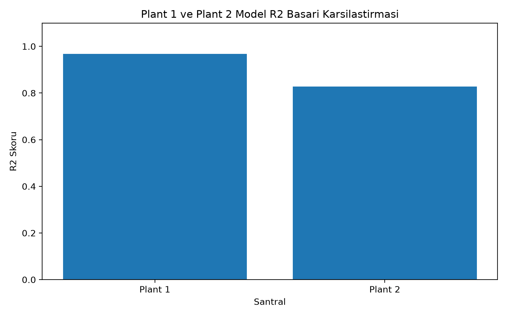
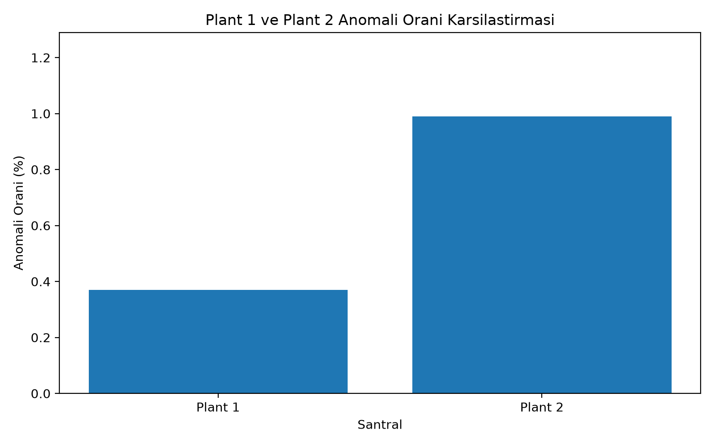
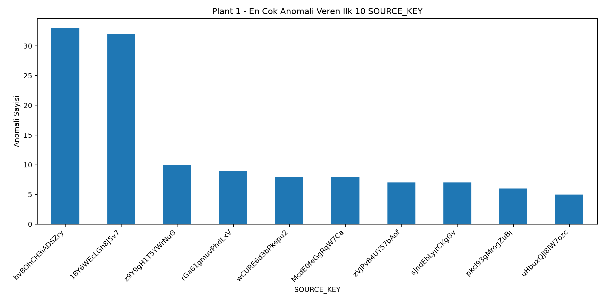
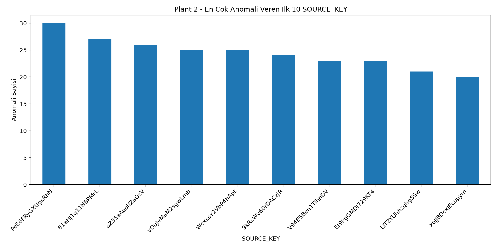
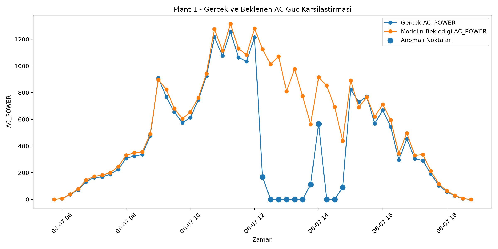
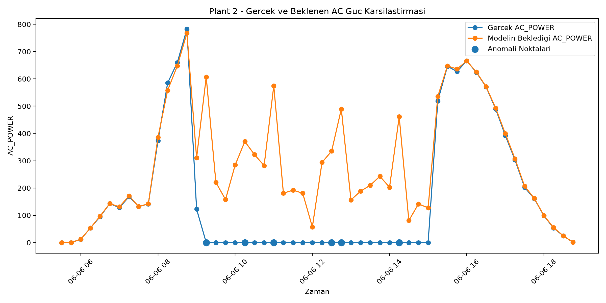
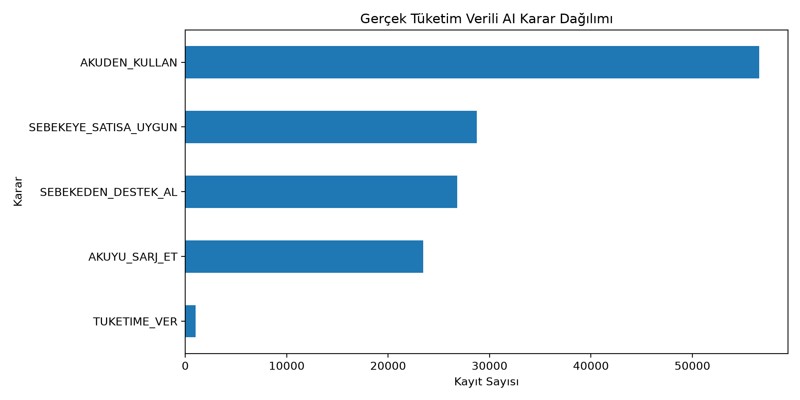
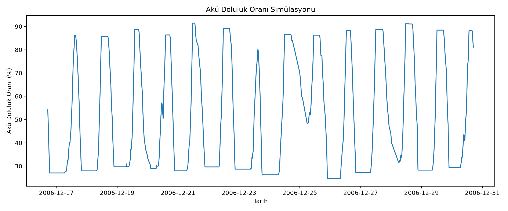

# Güneş Enerji Sistemlerinde Büyük Veri ve Yapay Zekâ Tabanlı Üretim Tahmini, Anomali Tespiti ve Akıllı Enerji Yönetimi

Bu repository, güneş enerji sistemlerinde üretim tahmini, anomali tespiti, büyük veri analizi, IoT tabanlı veri toplama, Kafka tabanlı veri akışı ve enerji yönetimi karar desteği süreçlerini içeren tez/proje çalışmasına ait kodları, görselleri ve dokümanları içermektedir.

---

## İçindekiler

* [Tez Dosyası](#tez-dosyası)
* [Projenin Amacı](#projenin-amacı)
* [Kullanılan Teknolojiler](#kullanılan-teknolojiler)
* [Kullanılan Veri Setleri](#kullanılan-veri-setleri)
* [Proje Klasör Yapısı](#proje-klasör-yapısı)
* [Ana Kod Dosyaları](#ana-kod-dosyaları)
* [IoT ve ESP32 Kodları](#iot-ve-esp32-kodları)
* [Kafka ve Veri Aktarım Kodları](#kafka-ve-veri-aktarım-kodları)
* [Model Performans Sonuçları](#model-performans-sonuçları)
* [Anomali Tespiti Sonuçları](#anomali-tespiti-sonuçları)
* [Enerji Yönetimi Simülasyonu](#enerji-yönetimi-simülasyonu)
* [Kurulum](#kurulum)
* [Çalıştırma](#çalıştırma)
* [Çalışmanın Sınırlılıkları](#çalışmanın-sınırlılıkları)
* [Geliştirme Önerileri](#geliştirme-önerileri)
* [Yazar](#yazar)
* [Danışman](#danışman)

---

## Tez Dosyası

Tez dosyasına aşağıdaki bağlantıdan ulaşabilirsiniz:

[GES TEZ MELİH TÜRK.docx](docs/GES%20TEZ%20MEL%C4%B0H%20T%C3%9CRK.docx)

---

## Projenin Amacı

Bu çalışmanın amacı, güneş enerji santrallerinde yalnızca gerçekleşen üretim değerlerini izlemek yerine, mevcut çevresel koşullara göre beklenen üretim değerini tahmin etmek ve beklenen üretim ile gerçekleşen üretim arasındaki sapmaları belirlemektir.

Bu yaklaşım sayesinde:

* Üretim performansı analiz edilebilir.
* Beklenen üretimden sapmalar erken fark edilebilir.
* Anomali görülen zamanlar ve kaynaklar belirlenebilir.
* Bakım ve saha incelemesi süreçleri veriye dayalı desteklenebilir.
* Üretim, tüketim, akü ve şebeke kararları birlikte değerlendirilebilir.

---

## Kullanılan Teknolojiler

| Alan             | Kullanılan Teknolojiler               |
| ---------------- | ------------------------------------- |
| Programlama      | Python                                |
| Veri Analizi     | Pandas, NumPy                         |
| Görselleştirme   | Matplotlib                            |
| Makine Öğrenmesi | Scikit-learn, Random Forest Regressor |
| Büyük Veri       | Apache Spark, Spark SQL               |
| Veri Akışı       | Kafka                                 |
| IoT              | ESP32, DHT22, BH1750, ACS712          |
| İzleme           | JupyterLab, HTML Dashboard            |

---

## Kullanılan Veri Setleri

Bu projede kullanılan büyük veri setleri GitHub repository içine eklenmemiştir. Bunun nedeni, veri setlerinin ve çıktı dosyalarının GitHub dosya boyutu sınırlarını aşabilmesidir.

Projede kullanılan veri kaynakları:

* Kaggle Solar Power Generation Data
* UCI Individual Household Electric Power Consumption

---

## Proje Klasör Yapısı

```text
GES-TEZ/
├── README.md
├── requirements.txt
├── .gitignore
├── .gitattributes
├── src/
│   ├── pipeline/
│   ├── iot_esp32/
│   ├── kafka_streaming/
│   ├── dashboard/
│   ├── modeling/
│   ├── spark_analysis/
│   └── energy_management/
├── figures/
├── docs/
└── sample_data/
```

---

## Ana Kod Dosyaları

Ana Python kodları `src/pipeline/` klasörü altında yer almaktadır.

| Dosya                                      | Açıklama                                                       |
| ------------------------------------------ | -------------------------------------------------------------- |
| `01_prepare_data.py`                       | Güneş enerji veri setlerinin hazırlanması ve birleştirilmesi   |
| `02_train_models.py`                       | Plant 1 ve Plant 2 için üretim tahmini modellerinin eğitilmesi |
| `03_detect_anomalies.py`                   | Beklenen ve gerçekleşen üretim farkına göre anomali tespiti    |
| `04_generate_charts.py`                    | Model, anomali ve karşılaştırma grafiklerinin oluşturulması    |
| `05_generate_reports.py`                   | Çıktı raporlarının hazırlanması                                |
| `06_spark_analysis.py`                     | Spark ile anomali çıktılarının analiz edilmesi                 |
| `07_spark_sql_hive_like.py`                | Spark SQL ile Hive benzeri sorgulama yapılması                 |
| `08_create_hadoop_data_lake.py`            | Yerel veri gölü klasör yapısının oluşturulması                 |
| `10_energy_management_ai.py`               | Enerji yönetimi karar destek modelinin oluşturulması           |
| `12_download_uci_consumption.py`           | UCI tüketim veri setinin indirilmesi                           |
| `13_prepare_consumption_data.py`           | Tüketim verisinin hazırlanması                                 |
| `14_energy_management_real_consumption.py` | Gerçek tüketim profiliyle enerji yönetimi simülasyonu          |
| `15_update_real_consumption_reports.py`    | Gerçek tüketim destekli raporların güncellenmesi               |
| `run_all.py`                               | Temel pipeline sürecini çalıştırmak                            |
| `run_all_extended.py`                      | Genişletilmiş süreci çalıştırmak                               |
| `run_all_real_consumption_extended.py`     | Gerçek tüketim destekli genişletilmiş süreci çalıştırmak       |

---

## IoT ve ESP32 Kodları

ESP32 kodları `src/iot_esp32/` klasörü altında yer almaktadır.

| Klasör / Dosya            | Açıklama                                                                      |
| ------------------------- | ----------------------------------------------------------------------------- |
| `esp_ortam_dht22_bh1750/` | DHT22 ve BH1750 sensörleriyle sıcaklık, nem ve ışık şiddeti verilerini toplar |
| `esp_panel_acs712/`       | ACS712 sensörüyle panel akım verisini okumak için kullanılır                  |
| `README_hardware.md`      | Donanım tarafına ait kısa açıklamaları içerir                                 |

---

## Kafka ve Veri Aktarım Kodları

Kafka ve veri aktarım kodları `src/kafka_streaming/` klasörü altında yer almaktadır.

| Dosya                       | Açıklama                                                              |
| --------------------------- | --------------------------------------------------------------------- |
| `pc_csv_stream_uploader.py` | ESP32/PC tarafında oluşan verileri dosya ve aktarım sürecine hazırlar |
| `upload_csv_to_jupyter.py`  | CSV/JSONL verilerinin JupyterHub ortamına gönderilmesini sağlar       |
| `README_iot_terminal.md`    | IoT terminal veri aktarım sürecine ait kısa açıklamaları içerir       |

Projede kullanılan Kafka topicleri:

```text
team.ges.v2.raw.env
team.ges.v2.raw.panel
team.ges.v2.raw.combined
```

---

## Model Performans Sonuçları

Çalışmada Plant 1 ve Plant 2 için ayrı Random Forest regresyon modelleri oluşturulmuştur.

| Santral | Model                   |     R² |     MAE |
| ------- | ----------------------- | -----: | ------: |
| Plant 1 | Random Forest Regressor | 0,9681 | 30,5077 |
| Plant 2 | Random Forest Regressor | 0,8273 |   72,73 |



---

## Anomali Tespiti Sonuçları

Anomali tespiti, model tarafından tahmin edilen beklenen AC güç değeri ile gerçekleşen AC güç değeri arasındaki fark üzerinden yapılmıştır.

| Santral | Modelleme Kayıt Sayısı | Anomali Sayısı | Anomali Oranı |
| ------- | ---------------------: | -------------: | ------------: |
| Plant 1 |                 38.376 |            141 |         %0,37 |
| Plant 2 |                 38.722 |            383 |         %0,99 |
| Toplam  |                 77.098 |            524 |             - |



---

## Kaynak Bazlı Anomali Analizi

Plant 1 ve Plant 2 için en çok anomali görülen kaynaklar ayrı ayrı incelenmiştir. Bu analiz, üretim sapmalarının belirli kaynaklarda yoğunlaşıp yoğunlaşmadığını anlamaya yardımcı olur.

### Plant 1 Kaynak Bazlı Anomali Dağılımı



### Plant 2 Kaynak Bazlı Anomali Dağılımı



---

## Beklenen ve Gerçekleşen AC Güç Karşılaştırması

Modelin tahmin ettiği beklenen AC güç değeri ile gerçek AC güç değeri karşılaştırılarak üretim sapmaları incelenmiştir.

### Plant 1



### Plant 2



---

## Enerji Yönetimi Simülasyonu

Enerji yönetimi aşamasında gerçek tüketim profiliyle desteklenen hibrit bir karar destek simülasyonu geliştirilmiştir. Bu bölümde üretim, tüketim, akü ve şebeke kararları birlikte değerlendirilmiştir.

| Karar Sınıfı          | Kayıt Sayısı |
| --------------------- | -----------: |
| AKUDEN_KULLAN         |       56.597 |
| SEBEKEYE_SATISA_UYGUN |       28.735 |
| SEBEKEDEN_DESTEK_AL   |       26.821 |
| AKUYU_SARJ_ET         |       23.473 |
| TUKETIME_VER          |        1.013 |

### Enerji Yönetimi Karar Dağılımı



### Akü Doluluk Oranı Simülasyonu



---

## Çalışmanın Genel İş Akışı

1. Güneş enerji üretim ve hava/sensör verilerinin hazırlanması
2. Plant 1 ve Plant 2 verilerinin ayrı ayrı modellenmesi
3. Random Forest ile beklenen AC güç tahmini yapılması
4. Beklenen ve gerçekleşen üretim farkı üzerinden anomali tespiti
5. Anomali sonuçlarının kaynak ve zaman bazında analiz edilmesi
6. Spark ve Spark SQL ile büyük veri mantığında sorgulama yapılması
7. ESP32 prototipiyle sensör verisi toplama altyapısının hazırlanması
8. Kafka topicleri ve dashboard ile canlıya yakın izleme yapısının test edilmesi
9. Gerçek tüketim profiliyle enerji yönetimi karar destek simülasyonunun oluşturulması

---

## Kurulum

Projeyi çalıştırmak için gerekli Python kütüphaneleri `requirements.txt` dosyasında verilmiştir.

```bash
pip install -r requirements.txt
```

---

## Çalıştırma

Temel pipeline sürecini çalıştırmak için:

```bash
python src/pipeline/run_all.py
```

Gerçek tüketim destekli genişletilmiş enerji yönetimi süreci için:

```bash
python src/pipeline/run_all_real_consumption_extended.py
```

> Not: Büyük veri setleri repository içine eklenmediği için kodların çalıştırılabilmesi için veri setlerinin ayrıca indirilmesi ve proje klasör yapısına uygun şekilde yerleştirilmesi gerekir.

---

## Repository İçine Eklenmeyen Dosyalar

Aşağıdaki dosyalar bilinçli olarak repository içine eklenmemiştir:

```text
solar_data/
consumption_data/
final_outputs/
hadoop_data_lake/
spark_outputs/
*.csv
*.jsonl
*.pkl
*.joblib
*.zip
```

Bu dosyalar büyük veri, model çıktısı veya ara çıktı dosyaları olduğu için GitHub dosya boyutu sınırlarını aşabilir.

---

## Çalışmanın Sınırlılıkları

Bu çalışma bir prototip ve karar destek yaklaşımıdır.

Ana modelleme süreci açık veri setleri üzerinden yürütülmüştür. ESP32’den alınan sensör verileri ana modelin eğitim verisi olarak kullanılmamış, gerçek zamanlıya yakın veri toplama ve izleme altyapısının uygulanabilirliğini göstermek amacıyla kullanılmıştır.

Enerji yönetimi bölümü gerçek bir GES tesisine ait tüketim verisiyle değil, UCI veri setinden alınan gerçek tüketim profiliyle desteklenen hibrit bir simülasyon olarak değerlendirilmelidir.

---

## Geliştirme Önerileri

* Gerçek bir güneş enerji santralinden uzun dönemli veri toplanabilir.
* ESP32 yerine endüstriyel sensör ve inverter logları kullanılabilir.
* Kafka ve Spark Streaming ile gerçek zamanlı anomali tespiti yapılabilir.
* Bakım kayıtları modele dahil edilerek anomali nedenleri sınıflandırılabilir.
* Akü kapasitesi, elektrik fiyatları ve şebeke kısıtlarıyla daha gelişmiş enerji optimizasyonu yapılabilir.
* Dashboard yapısı web tabanlı ve kullanıcı girişli bir sisteme dönüştürülebilir.

---

## Yazar

**Melih Türk**
Bursa Uludağ Üniversitesi
İnegöl İşletme Fakültesi
Yönetim Bilişim Sistemleri Bölümü

---

## Danışman

**Prof. Dr. Melih Engin**

---

## Not

Bu repository, tez çalışmasının kod, görsel ve açıklama dosyalarını paylaşmak amacıyla hazırlanmıştır. Büyük veri setleri ve model dosyaları repository içine eklenmemiştir.
